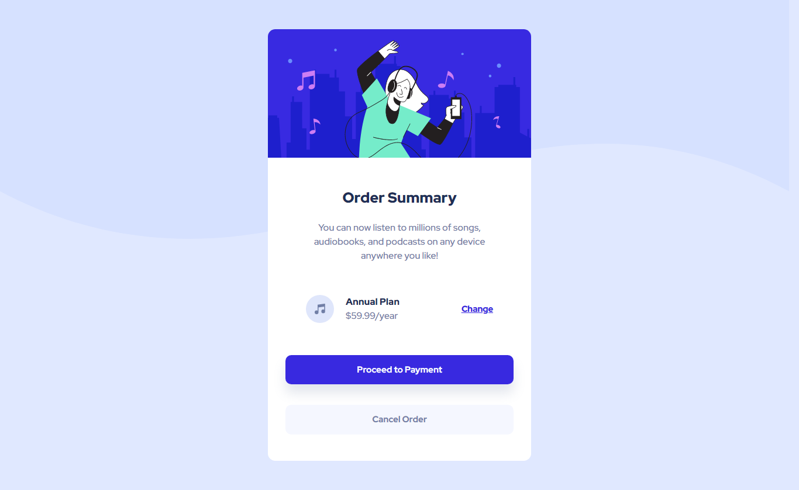

# Frontend Mentor - Order summary card solution

This is a solution to the [Order summary card challenge on Frontend Mentor](https://www.frontendmentor.io/challenges/order-summary-component-QlPmajDUj). Frontend Mentor challenges help you improve your coding skills by building realistic projects. 

## Table of contents

- [Overview](#overview)
  - [Screenshot](#screenshot)
  - [Links](#links)
- [My process](#my-process)
  - [Built with](#built-with)
  - [What I learned](#what-i-learned)
- [Author](#author)

**Note: Delete this note and update the table of contents based on what sections you keep.**

## Overview

### Screenshot

### Links

- Solution URL: [Add solution URL here](https://github.com/Bouyyah/Order-summary-component)
- Live Site URL: [Add live site URL here](https://bouyyah.github.io/Order-summary-component/)

## My process

### Built with

- Semantic HTML5 markup
- Sass preprocessor
- SCSS custom properties
- Flexbox
- Grid layout
- Mobile-first workflow

### What I learned

I used this project to mix flexbox and grid layout, as specefied within the challenge i used the active pseudo class to change css, the handling of the svg backgrouds was a bit tricky but i managed to do it with position absolute and z-index manipulation.

## Author

- Frontend Mentor - [@Bouyyah](https://www.frontendmentor.io/profile/Bouyyah)

